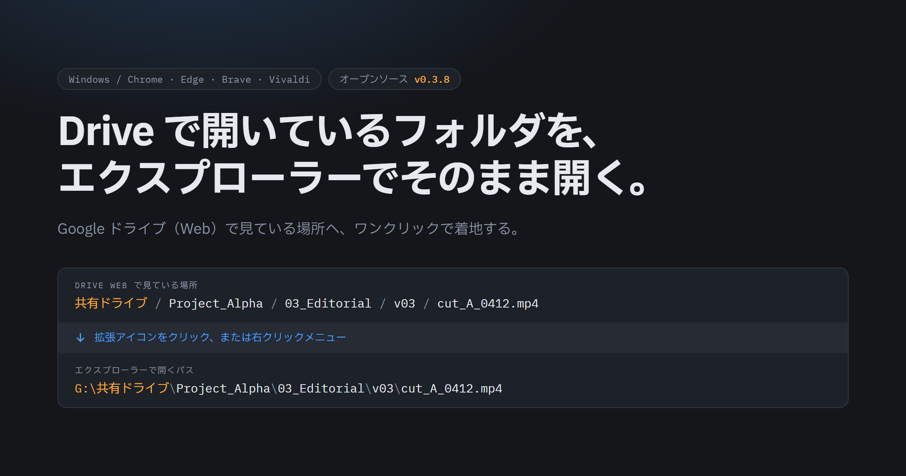
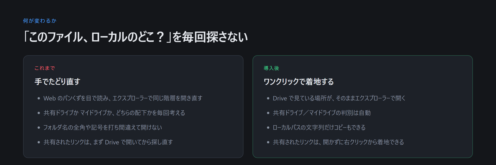
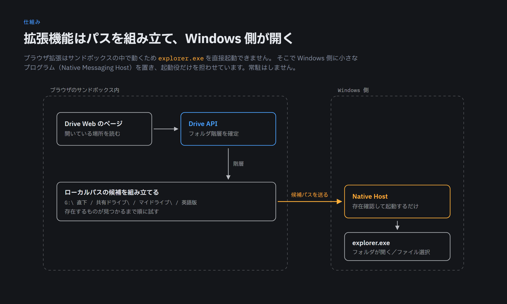

# Drive to Explorer



Google Drive (Web) で開いているフォルダを、ワンクリックで Windows エクスプローラーの対応するローカルフォルダ (Drive for desktop のミラー先) として開く Chromium 系ブラウザ拡張。

ブラウザのサンドボックスから直接 `explorer.exe` は起動できないため、**ブラウザ拡張 (Manifest V3) + Native Messaging Host (Python)** の構成で実現しています。

対応ブラウザ: Chrome / Edge / Brave / Vivaldi / Chromium
対応 OS: Windows 10 / 11

> 🖼 **概要を知りたい方へ**: 何ができるか・仕組み・導入前の注意を 1 枚にまとめた [`docs/intro.html`](docs/intro.html) をブラウザで開いてください。
>
> 📖 **セットアップ手順**: 手順・更新・権限をまとめた [`docs/index.html`](docs/index.html) をブラウザで開いてください（zip 同梱）。
>
> 🔄 **v0.3.0+**: オプション画面の「今すぐ更新」ボタンから、**UI だけでアップデート→自動再読み込み**が可能になりました（bat 実行・コピペ・ブラウザ再起動は不要）。

---

## 何が変わるか

Drive for desktop はドライブを丸ごとミラーしますが、Web 画面とエクスプローラーは別々の世界です。フォルダ階層が深いほど、同じ場所をもう一度たどる手間が積み上がります。



---

## 仕組み (要約)

1. Drive Web 上で「フォルダ情報 → エクスプローラーで開く」を選ぶ、または拡張アイコンの popup から開く
2. content script が「**パスを表示**」ボタンを内部的にクリックして折り畳まれた祖先フォルダを取得し、breadcrumb バー上の可視祖先と現在フォルダを連結して**完全なフォルダ階層**を組み立てる
3. background が「ローカルルートパス」の配下で `<root>\` `<root>\共有ドライブ\` `<root>\マイドライブ\` (および英語版) を順に試行
4. 存在するパスを Native Messaging で Python ホストに送信
5. Python ホストが `explorer.exe <path>` を起動



---

## ディレクトリ構成

```
drive-to-explorer/
├── extension/                   # ブラウザ拡張 (Manifest V3)
│   ├── manifest.json
│   ├── background.js            # Native Messaging / コンテキストメニュー / popup ルーティング
│   ├── content.js               # Drive UI 解析 / パス取得 / メニュー注入
│   ├── popup.html / popup.js    # ツールバーアイコン押下時の UI
│   ├── options.html / options.js # 設定画面 (ローカルルートパス)
│   └── icons/                   # 16 / 48 / 128 px PNG
├── native-host/
│   ├── drive_to_explorer_host.py  # stdin/stdout プロトコル + explorer 起動
│   ├── drive_to_explorer_host.bat # Python 呼び出しラッパー (Chrome から起動される実体)
│   ├── manifest.json              # Native Messaging Host マニフェスト
│   ├── install.bat                # レジストリ登録
│   └── uninstall.bat              # レジストリ削除
├── docs/
│   ├── intro.html               # 紹介資料 (何ができるか・仕組み・導入前の注意)
│   ├── index.html               # セットアップ手順書
│   ├── GCP_SETUP.md             # 独自 OAuth Client ID の発行手順
│   └── img/                     # 紹介画像 (README から参照)
├── setup.bat / setup.ps1        # 初回セットアップ一括 (配布先はこれをダブルクリック)
├── update.bat / update.ps1      # 手動更新のフォールバック
└── README.md
```

---

## セットアップ

### かんたんセットアップ（推奨・これだけで済みます）

zip を安定パス（後述）に展開したら、**`setup.bat` をダブルクリック**してください。次を一括で行います:

1. 展開場所が更新に適しているか点検（バージョン入りフォルダ・Downloads 配下なら警告）
2. Native Messaging Host のレジストリ登録（**拡張機能 ID の入力は不要**。固定 ID を自動採用）
3. Drive for desktop のミラールート（`I:\` 等）を自動検出して表示（準備完了しているドライブのみ走査するため、切断済みネットワークドライブがあっても止まりません）
4. 拡張機能の読み込み手順を表示し、`extension` フォルダの絶対パスを**クリップボードへコピー**
5. 配布先向けガイド（`docs/index.html`）を開く

残る作業はブラウザ側の 3 手だけです:

1. `chrome://extensions`（Edge は `edge://extensions` 等）を開く → 「デベロッパーモード」を ON
2. 「パッケージ化されていない拡張機能を読み込む」→ アドレス欄に `Ctrl+V` で貼り付けて `extension` フォルダを選択
3. ブラウザを完全終了 → 再起動 → 拡張アイコン右クリック → オプション → 「サインイン」

**ローカルルートパスの手入力は不要です。** 拡張の初回インストール時、および以降のブラウザ起動時に Native Host 経由で自動検出して設定します（Native Host はブラウザ起動時にしか読み込まれないため、実際に設定されるのは上記 3 のブラウザ再起動後です）。1 度成功すると以後は上書きしません。検出できなかった場合のみ、オプション画面の「自動検出」または手入力で設定してください。

以降は、各工程を個別に実行したい場合の詳細手順です。

### 推奨インストール先

将来の更新を楽にするため、**バージョン無しの安定パス** に展開することを推奨します:

```
C:\Tools\drive-to-explorer\
```

（ドライブレターや配置先は任意ですが、バージョン番号を含まないフォルダ名にしてください）

zip を `drive-to-explorer-v0.2.1/` のようなバージョン入りフォルダのまま使うと、更新のたびに Native Host のレジストリパスが変わり再登録が必要になります。安定フォルダなら `update.bat` で上書き更新 → Native Host も自動再登録できます。

### 前提
- **Drive for desktop** がインストールされ、ドライブレター (例: `I:\`) でマウントされていること
- 以下のいずれかを満たすこと:
  - **Python 3** がインストール済みで、`py` または `python` で起動できる（確認: `py -3 -V` または `python -V`）
  - もしくは事前ビルド済みの `native-host/drive_to_explorer_host.exe` が同梱されている（リリース zip には同梱済み）

### 1. 拡張機能を読み込む

1. ブラウザの拡張機能ページを開く
   - Chrome: `chrome://extensions`
   - Edge: `edge://extensions`
   - Brave: `brave://extensions`
   - Vivaldi: `vivaldi://extensions`
2. 右上の **「デベロッパーモード」を ON**
3. **「パッケージ化されていない拡張機能を読み込む」** → このリポジトリの `extension/` フォルダを選択
4. 表示される **拡張機能 ID** は **`pkiecgchhhhcgnjjgofmlfobbhacdcge`** に固定されます
   - v0.2.0+ で `manifest.key` により ID が固定化されているため、別 PC でロードしても同じ ID になります
   - 配布パッケージや GCP の OAuth 設定が「1回だけ」で全マシンに通用

### 2. Native Host を登録

`setup.bat` を使った場合はこの工程は完了済みです。個別に実行する場合のみ以下を行います。

1. `native-host/install.bat` をダブルクリック
2. **入力は不要です。** manifest.json から既定の拡張機能 ID `pkiecgchhhhcgnjjgofmlfobbhacdcge` を読んで自動採用します
3. Chrome / Edge / Brave / Vivaldi / Chromium の HKCU レジストリに自動登録
4. **ブラウザを完全終了** → 再起動
   - タスクマネージャーで `<browser>.exe` プロセスが残っていないか確認

> **別 ID を使いたい場合**: `install.bat <extension_id>` のように引数で渡すか、
> `powershell -File install.ps1 -Interactive` で従来どおり対話入力できます。

### 3. ローカルルートパスを設定

**通常この工程は不要です。** 拡張の初回インストール時に Native Host の `detect_roots` で
自動検出・設定されます（検出条件: ドライブ直下または `%USERPROFILE%` 直下に
`マイドライブ` / `My Drive` / `共有ドライブ` / `Shared drives` のいずれかが存在すること）。

自動検出が効かなかった場合、または後から変更したい場合のみ:

1. 拡張アイコンを右クリック → 「オプション」 (または `chrome://extensions` → 詳細 → 拡張機能のオプション)
2. **「自動検出」** をクリック（検出できない場合はドライブレターを手入力。例: `I:\`）
3. 「ルート存在チェック」 → 「保存」

> **パス解決について**: Drive for desktop は共有ドライブを `<root>\共有ドライブ\<drive名>\...`、マイドライブを `<root>\マイドライブ\...` 配下にミラーします。本拡張はルートを起点に「直下」「`共有ドライブ\`」「`マイドライブ\`」（英語版 `Shared drives\` / `My Drive\` も）を**自動で順次試行**し、最初に存在するパスを開きます。なのでルートはドライブレターのみ (例: `I:\`) を指定すれば OK です。

---

### 4. OAuth サインイン (推奨)

v0.2.2+ から **配布版に既定の OAuth Client ID が同梱** されているので、通常は **「サインイン」ボタンを押すだけ** で API モードが使えるようになります。

1. 拡張オプション画面を開く（拡張アイコン右クリック → 「オプション」）
2. **Drive REST API (OAuth)** セクションの **「サインイン」** をクリック
3. 別タブで Google アカウント選択 → 「許可」
4. **「✓ サインイン済み (既定 Client ID 使用)」** が出れば完了

> **「このアプリは確認されていません」と警告が出る場合**: 「詳細」 → 「Drive to Explorer に移動」で進む。これは「Google 審査を通っていない自作アプリ」の標準警告で問題なし。

#### 独自の Client ID を使いたい場合 (任意)

組織内で独自の GCP プロジェクトで管理したい等の場合は、自分で OAuth Client ID を発行してオプション画面に貼り付けてください。詳細手順: [docs/GCP_SETUP.md](docs/GCP_SETUP.md)
（リダイレクト URI は `https://pkiecgchhhhcgnjjgofmlfobbhacdcge.chromiumapp.org/` 固定）

#### 簡単セットアップ (推奨): セットアップウィザード

1. 拡張オプション画面を開く
2. OAuth セクションの **「セットアップウィザードを開く」** をクリック
3. 5 ステップのモーダルに従って進む（各ステップで「Cloud Console を開く」が正しいページに直接ジャンプ、リダイレクト URI は自動でクリップボードにコピー）
4. 最後のステップでクライアント ID を貼り付け → 「保存してサインイン」

詳細手順 (ウィザードを使わない場合) は以下：

#### A. Google Cloud Console で OAuth クライアントを作成

1. [Google Cloud Console](https://console.cloud.google.com/) でプロジェクト作成 (既存のものでも可)
2. **API ライブラリ** → 「Google Drive API」を有効化
3. **OAuth 同意画面** を構成
   - User Type: 外部
   - スコープ追加で `.../auth/drive.metadata.readonly` を追加 (検索: `drive.metadata.readonly`)
   - テストユーザーに自分の Gmail を追加
4. **認証情報** → **「OAuth クライアント ID を作成」** → 種類は **「ウェブ アプリケーション」**
5. **承認済みのリダイレクト URI** に拡張オプション画面に表示される URI を追加 (後述 B 参照)
   - 形式: `https://<extension_id>.chromiumapp.org/`
6. 発行された **クライアント ID** をコピー (例: `1234567890-abc...apps.googleusercontent.com`)

#### B. 拡張オプションに登録

1. 拡張オプション画面を開く
2. **「リダイレクト URI」欄の文字列**をコピー → Google Cloud のリダイレクト URI 欄に追加 (上記 5)
3. **「OAuth Client ID」**にコピーしたクライアント ID を貼り付け → 「Client ID 保存」
4. 「サインイン」ボタンをクリック → Google アカウント選択 → 権限承認
5. 「✓ サインイン済み」と出れば完了

> **同梱している既定 Client ID について**: Client ID は OAuth 同意画面で誰にでも見える値で、秘密情報ではありません。本拡張は `response_type=token` の implicitフローを使うため Client **Secret** は不要で、リポジトリにも含まれていません。発行されるトークンは**サインインした本人の Drive** に対する`drive.metadata.readonly`（フォルダ名と親子関係の参照のみ）で、
> 作者のデータにアクセスする手段にはなりません。
>
> ただし `manifest.key` を同梱しているため第三者が同じ拡張機能 ID を再現でき、既定 Client ID を使われると作者の GCP プロジェクトのクォータを消費します。そのため既定 Client ID は OAuth 同意画面を「テスト」ステータスで運用しており、**テストユーザーに登録されていないアカウントではサインインできません**。
>
> **一般の利用者は自分の Client ID を発行してください。** オプション画面の「セットアップウィザード」に従うか、[docs/GCP_SETUP.md](docs/GCP_SETUP.md) を参照してください。オプション画面に入力した Client ID は既定値より優先されます。

> **挙動**: API は最優先で試行され、失敗時 (Client ID 未設定 / トークン失効 / オフライン) は自動的に DOM 解析にフォールバックします。
>
> **権限スコープ**: `drive.metadata.readonly` のみ — フォルダ名・親情報のみ参照。ファイル内容は読みません。

### 5. (任意) Explorer → Drive Web の逆方向

Windows Explorer 上でフォルダを右クリック → 「**Drive で開く**」で対応する Drive Web フォルダを開けるようになります。

> **前提**: ステップ 4 (OAuth 設定 + サインイン) を完了していること。Drive API でフォルダ階層を逆引きするため必須。

1. `shell-integration/install_shell.bat` をダブルクリック
   - `HKCU\Software\Classes\Directory\shell\DriveToExplorer` 配下にコンテキストメニュー登録 (管理者権限不要)
2. Explorer でフォルダを右クリック → 「Drive で開く」
   - Windows 11 では「**その他のオプションを表示**」配下に出ることがあります
3. ブラウザで Drive Web が開き、対応するフォルダに自動遷移

**仕組み**: 拡張は URL fragment `#dte_resolve=<encoded path>` を検知し、background が「`localRoot` を剥がす → `共有ドライブ`/`マイドライブ` プレフィックスを判定 → セグメントを順に Drive API で名前検索」してフォルダ ID を解決、`/drive/u/0/folders/<id>` に遷移します。

**アンインストール**: `shell-integration/uninstall_shell.bat`

### 6. (任意) Python 不要モード — `.exe` 化

配布先の PC に Python を入れたくない場合、**ビルド側で 1 度だけ** `.exe` を生成して同梱する：

1. ビルドする PC で `pip install pyinstaller` （初回のみ）
2. `native-host/build.bat` をダブルクリック実行
   - `pyinstaller --onefile --noconsole drive_to_explorer_host.py` 相当を実行
   - 同フォルダに `drive_to_explorer_host.exe` が生成される
3. 配布先には `extension/` と `native-host/`（`.exe` 入り）を渡せば OK
4. 配布先で `install.bat` を実行 → `drive_to_explorer_host.bat` は **`.exe` があれば優先**、無ければ Python にフォールバック

> ウイルス対策ソフトが PyInstaller の onefile を誤検出することがあります。除外設定するか、Python ありモードで運用してください。

---

## 使い方

### A. 右クリックメニュー (推奨・最も確実)

1. Drive Web でフォルダを表示
2. フォルダや空白部分で右クリック → 「フォルダ情報」 → **「エクスプローラーで開く」**
3. エクスプローラーで対応ローカルフォルダが開く

ファイルを右クリックした場合は、ファイルが選択された状態でエクスプローラーが開きます。

### B. ツールバーアイコン (popup)

1. Drive Web でフォルダを表示
2. ツールバーの拡張アイコンをクリック
3. Drive 階層・解決先のローカルパス候補が表示される
4. **「エクスプローラーで開く」** をクリック → 完全パスを取得してエクスプローラーが開く
5. もしくは **「パスをコピー」** でローカルパス文字列をクリップボードにコピー

### C. ローカルパスのコピーのみ

エクスプローラーで開かず、Slack 共有・スクリプト引数・他ツールへの貼り付け用にローカルパス文字列だけ欲しい場合：

- **右クリック → フォルダ情報 → 「ローカルパスをコピー」**
  - 解決後、画面右下にトーストで結果表示
  - クリップボード書込が失敗した場合はモーダルが出るので手動コピー
- **popup の「パスをコピー」ボタン**

### D. 受け取ったリンクを右クリック

Slack・メール・任意の Web ページ上にある Drive / Google ドキュメントのリンクを右クリック → **「エクスプローラーで開く」** を選ぶと、リンクを開かずに直接ローカルのフォルダ／ファイルへ飛べます。

- リンク先がフォルダなら該当フォルダを開き、ファイルならローカルの同名ファイルを選択した状態で開きます。
- Google ドキュメント / スプレッドシート等のネイティブ形式は、ミラー上の実体名（`議事録.gdoc` のように拡張子付き）へ自動変換して探します。
- この機能は Drive API でリンク先の種別を判別するため、**OAuth サインインが必須**です。
- `docs.google.com/forms/d/e/<id>/viewform`（公開フォームの回答 URL）はファイル ID を含まないため対象外です。

---

## 技術メモ

### パス取得ロジック

Drive Web の現代 UI は breadcrumb を「**折り畳まれた祖先 (popup)**」と「**バー上の可視祖先**」に分けています。本拡張は両方を取得して連結：

```
[popup の中身: Projects, ClientA] + [バー可視: Editorial] + [現在: v03]
= ['Projects', 'ClientA', 'Editorial', 'v03']
```

「パスを表示」ボタンは Drive の jsaction 経由で動作するため、`Element.click()` では反応しません。`PointerEvent / MouseEvent` の完全なシーケンス (`pointerdown → mousedown → pointerup → mouseup → click`) を bubbles + composed 付きで dispatch する `realClick()` で発火させています。

### user activation の伝播

popup から content script へ `chrome.tabs.sendMessage` で依頼すると Chrome の **user activation が失われ**、Drive UI が `realClick` を無視します。`chrome.scripting.executeScript({world:"MAIN"})` を popup の click ハンドラ内で同期的に呼ぶことで activation を保持。MAIN world から CustomEvent をディスパッチして isolated world の content script に渡しています。

### Native Messaging プロトコル

stdin に 4byte little-endian 長 + JSON、stdout に同形式（Chromium Native Messaging 仕様）。

- レスポンス: `{"ok":true}` / `{"ok":false,"error":"..."}`
- `path` はドライブレター始まりの絶対パスのみ受理。`..` を含むパスは拒否。

| action | 入力 | 用途 |
|---|---|---|
| `open` | `path` | エクスプローラーでフォルダを開く |
| `select` | `path` | ファイルを選択状態で開く（無ければ親フォルダ） |
| `exists` | `path` | 存在確認 |
| `exists_many` | `paths` | 複数パスの存在を 1 往復で確認 |
| `list_subdirs` | `paths` | 各パス直下のサブディレクトリ名を列挙（共有ドライブ名の補完に使用） |
| `detect_roots` | — | Drive for desktop のミラールート候補を自動検出 |
| `version_info` | — | インストールルートと、そこに置かれた拡張のバージョンを返す |
| `update` / `update_status` | — | ワンクリック更新の起動と進捗取得 |
| `ping` | — | 生存確認 |

ホストのログ: `%TEMP%\drive_to_explorer_host.log`

---

## オプション画面「実行中の構成」

ブラウザが読み込んでいる拡張機能と、Native Host が置かれているフォルダを突き合わせて表示します。

| 表示 | 意味 |
|---|---|
| 読み込まれている拡張のバージョン | `chrome.runtime.getManifest().version` |
| Native Host のインストール先 | Host が自身のファイル位置から逆算した `INSTALL_ROOT` |
| そこに置かれた拡張のバージョン | `<INSTALL_ROOT>\extension\manifest.json` の `version` |

**この 2 つのバージョンが食い違っていたら、ブラウザは別フォルダの古い拡張を読み込んでいます。**
「更新したのに挙動が変わらない」の典型的な原因なので、リリース後に挙動が変わらないと感じたらまずここを確認してください。

拡張機能は自分がどのフォルダから読み込まれたかを知る API を持たないため、Native Host に自己申告させる形で実現しています。

---

## 共有ドライブ名の扱い（既知の制約）

**popup の「Drive 階層」に共有ドライブ名が表示されないことがあります。これは仕様上の制約で、エクスプローラーは正しく開きます。**

理由: 共有ドライブ名を返す Drive API は `drives.get` だけですが、これは `drive` / `drive.readonly` スコープを要求します。本拡張は最小権限の `drive.metadata.readonly` で動作しているため 403 になります。共有ドライブのルートフォルダを `files.get` しても、返るのは実際の名前ではなく「ドライブ」というローカライズされた汎用ラベルです。

対策: ローカルパスの解決に失敗した場合、`<root>\共有ドライブ\*` と `<root>\Shared drives\*` を Native Host で列挙し、各ドライブ名を挟んだ候補で再試行します。API に依存しないため、名前が取得できなくても解決できます。

> スコープを広げれば表示も解決しますが、GCP の同意画面変更と全ユーザーの再同意が必要になるため採用していません。

---

## ツールバーアイコンのバッジ

ツールバーアイコンに小さなバッジが付くことがあります（5 分ごと + 設定変更時に自動更新）：

| バッジ | 状態 | 対応 |
|---|---|---|
| 🔴 `!` (赤) | ローカルルートパス未設定 | オプション画面で `I:\` 等を設定 |
| 🟠 `!` (橙) | Native Host 未登録 | `install.bat` を実行してブラウザ再起動 |
| (バッジ無し) | 動作可能 | アイコンにマウスを乗せると詳細 (OAuth モード等) が tooltip 表示 |

OAuth は任意機能なので未設定でもバッジは出ません。tooltip に `(DOM 解析モード)` 等で示されます。

---

## トラブルシューティング

### 「Native host has exited」/「Specified native messaging host not found」
- `native-host/manifest.json` の `allowed_origins` の拡張 ID が現在の拡張 ID と一致しているか確認
- `native-host/install.bat` を再実行 → ブラウザを完全終了して再起動
- レジストリ確認: `regedit` で
  `HKCU\Software\<Google\Chrome|BraveSoftware\Brave-Browser|Microsoft\Edge>\NativeMessagingHosts\com.yato.drive_to_explorer`
  の (規定) 値が `manifest.json` の絶対パスになっているか

### 何も起きない / エラー通知が出る
- Native Host のログを確認: `%TEMP%\drive_to_explorer_host.log`
- Python が PATH に通っているか: `py -3 -V` / `python -V`
- ブラウザの開発者ツール → 拡張の service worker / content script コンソールに `[DTE]` ログが出ているか

### 「今すぐ更新」が「適用中…」から進まない

**v0.3.8 で修正済み。** それ以前のバージョンでは、`updater.ps1` が `status.json` を
UTF-8 BOM 付きで書き（Windows PowerShell 5.1 の `Set-Content -Encoding UTF8` の仕様）、
それを読む Native Host の `json.load` が BOM で失敗するため、進捗と完了が拡張側に
一切届きませんでした。**ファイルの入替自体は成功している**ので、options ページを
閉じて開き直し、「実行中の構成」でバージョンを確認すれば更新済みと分かります。

v0.3.8 以降は Host が `utf-8-sig` で読むため BOM 有無の両方を受け付けます。
また 20 秒以上進捗が取れない場合は、画面に理由が表示されます。

### 更新したのに挙動が変わらない

オプション画面の **「実行中の構成」** を確認してください。ブラウザが別フォルダの古い拡張を読み込んでいる場合、バージョンの不一致として検出されます。

### popup に「Drive API が未サインインです (NEEDS_INTERACTIVE)」と出る

オプション画面の **「サインイン」** を実行してください。API 未サインインだと DOM 解析へフォールバックし、ファイル単体 URL では親階層が取得できないため解決に失敗します。

サインインしても直らない場合は、オプション画面の **「API モードをテスト」** でエラーコードを確認してください。`403` / `404` はサインインでは解決しません。

### 「ローカルパスが見つかりません」
- popup or 通知に「試したパス: ...」が表示される
- 該当パスが実際に Drive for desktop にミラーされているか確認
- 共有ドライブの場合: `<root>\共有ドライブ\<sharedDriveName>\...`
- 中間フォルダが Drive UI 上で「...」で省略されているケースは正しく解決されますが、稀に取りこぼす場合は **右クリックメニュー経由**を試してください

### Drive UI 変更でパンくずが取れなくなった
- `extension/content.js` の `getVisibleMidBreadcrumbs` / `readPathViaShowPath` / `getCurrentFolderName` を要更新
- DevTools コンソールで `[DTE] readPathViaShowPath: result= ...` の中身を確認すれば、どこで取れていないか判別できます

---

## 更新方法

### A. UI からワンクリック更新 (推奨・v0.3.0+)

オプション画面ヘッダーの **「今すぐ更新」** ボタンを押すだけ。**bat 実行・コピペ・ブラウザ再起動はすべて不要**です。

動作:
1. 拡張 → Native Host に `update` を送信
2. Native Host が `updater.ps1` を**デタッチ起動**して即応答（自身は終了し exe ロックを解放）
3. `updater.ps1` が GitHub Releases から最新 zip を DL → 展開 → 旧ホスト終了待ち → 全ファイル上書き（`extension/` `native-host/`(exe 含む) `shell-integration/` `docs/` `README.md`）
4. 進捗は `%TEMP%\dte_update\status.json` に記録され、拡張がポーリング表示
5. `done` を検知すると拡張が `chrome.runtime.reload()` で**自動再読み込み** → 新バージョン反映

> **仕組みのポイント**: ブラウザ拡張は自分自身のファイルを書き換えられないため、ファイル操作は OS 権限を持つ Native Host (`updater.ps1`) に委譲。実行中の exe は自分を上書きできないので、ホストは「起動役」に徹してすぐ終了し、updater が入れ替えます。Native Host は接続ごとに起動されるため、次回呼び出しで自動的に新 exe が使われます（ブラウザ再起動不要）。
>
> `manifest.key` により拡張機能 ID は不変なので、`chrome.storage.sync` の ローカルルートパスと OAuth Client ID は更新後も保持されます。OAuth セッションだけは切れることがあるので、必要なら「サインイン」を押し直してください。

### B. フォールバック: `update.bat`

UI 更新が失敗した場合（ネットワーク不調・ファイルロック等）に備え、従来の `update.bat` も残しています。インストールフォルダ直下の **`update.bat`** をダブルクリック → 最新版を取得・展開し `native-host/install.bat` まで自動実行します。

### C. 手動更新

1. [Releases](https://github.com/hakuseiyato/drive-to-explorer/releases) から最新 zip をダウンロード
2. 既存インストール先に上書き解凍
3. `native-host/install.bat` をダブルクリック → Enter で承認
4. ブラウザを完全終了 → 再起動 → `brave://extensions` で拡張の「↻ 再読み込み」

---

## アンインストール

1. ブラウザの拡張機能ページから「Drive to Explorer」を削除
2. `native-host/uninstall.bat` を実行 (HKCU レジストリから削除)

---

## スコープ外（将来拡張）

- Drive UI のローカライズ動的検出（現状は日本語/英語の文字列がハードコード、`extension/content.js` の `LOCALE_STRINGS` 集約は未実施）
- 完全な i18n (UI 文言の翻訳)
- macOS / Linux 対応
- 拡張機能の Chrome Web Store 公開（現状は Unpacked load 前提）

---

## サポートする URL パターン

| URL | 挙動 |
|---|---|
| `https://drive.google.com/drive/folders/<id>` | フォルダ → ローカル Explorer で開く |
| `https://drive.google.com/file/d/<id>/view` | ファイル単体プレビュー → ローカル同名ファイルがあれば選択、無ければ親フォルダを開く（OAuth セットアップ済みで有効）|
| `https://drive.google.com/open?id=<id>` | API 経由でフォルダ/ファイルを自動判別して開く（OAuth サインイン必須）|
| `https://docs.google.com/*/d/<id>`（リンク右クリック時のみ） | Google ドキュメント/スプレッドシート等のリンク → API でファイルを解決してローカルの同名ファイルを選択（OAuth サインイン必須）|

> ファイル単体URL対応は v0.2.0 で追加。OAuth 未設定時は title からファイル名のみ抽出してフォールバック動作。

---

## キーボードショートカット

`chrome://extensions/shortcuts` (Edge は `edge://extensions/shortcuts` 等) で **「現在の Drive フォルダ（またはファイル）をエクスプローラーで開く」** にキー割当可能。

デフォルトは未割当（拡張間衝突を避けるため）。`Ctrl+Shift+E` 等の好みの組み合わせを設定。

---

## デバッグログ

オプション画面の「デバッグ」セクションで **「コンソールログ出力」** を ON にすると、Drive ページコンソールおよび Service Worker コンソールに `[DTE]` プレフィックス付きの詳細ログが出ます。

通常運用ではオフのままで OK。トラブル調査時のみ ON にして DevTools でログを確認します。

---

## リリース

`v*` パターンのタグを push すると、GitHub Actions が自動で：

1. `windows-latest` ランナー上で PyInstaller を使い `drive_to_explorer_host.exe` をビルド
2. `extension/` + `native-host/`（exe 入り）+ `shell-integration/` + `README.md` を一括 zip 化
3. Release を作成し zip をアセット添付（`gh release create --generate-notes`）

```bash
git tag v0.2.0
git push origin v0.2.0
```

タグ push 後 1〜2 分で `https://github.com/hakuseiyato/drive-to-explorer/releases` に zip が現れる。配布先には zip を渡すだけで Python 不要モードで動作する。

手動再生成は GitHub Actions UI の `Release` ワークフローを `workflow_dispatch` で起動。

---

## ライセンス

本リポジトリは個人/社内利用を想定したカスタムツールです。改変・再配布は自由ですが、保証はありません。
